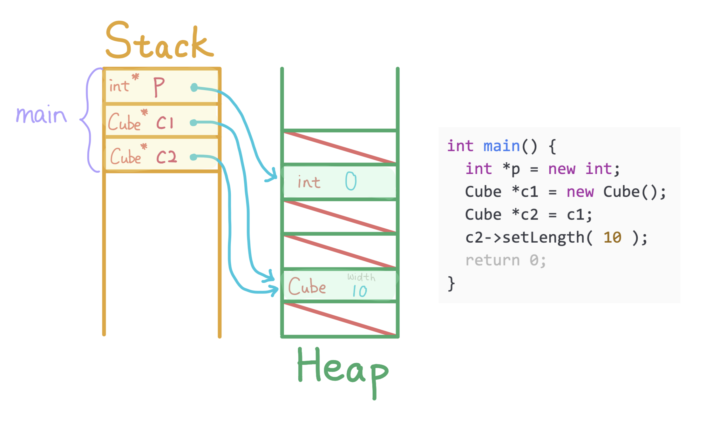

1. Allocate an integer with default value `0` on the heap, allocate `p` on `main`'s stack to store the address of the integer

---

2. Allocate a `Cube` with default width` 20` on the heap, allocate `c1` on `main`'s stack to store the address of the `Cube`.

---

3. Allocate `c2` on `main`'s stack and store a copy of `c1`.

---

4. Call method `setLength` on `c2`, changes the width of the `Cube` pointed by both `c1` and `c2`.

---

5. Deallocate stack memory of `main` and return `0`.

