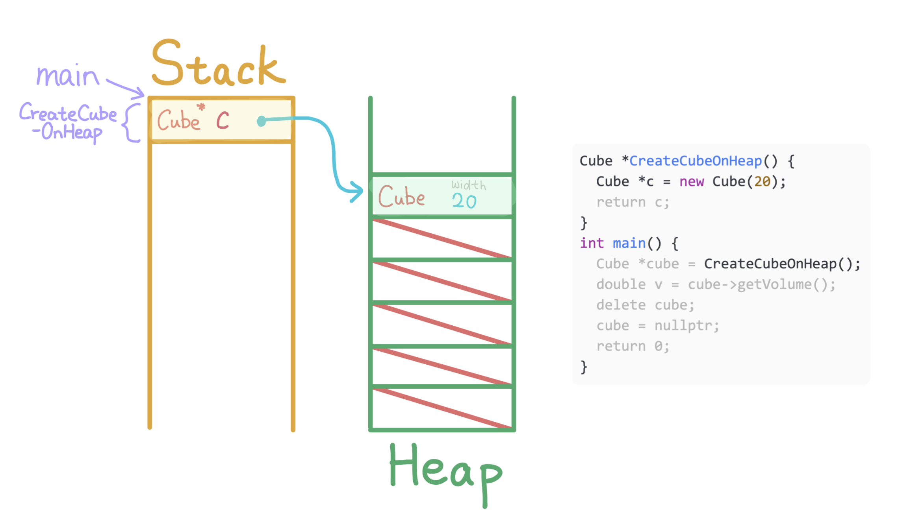
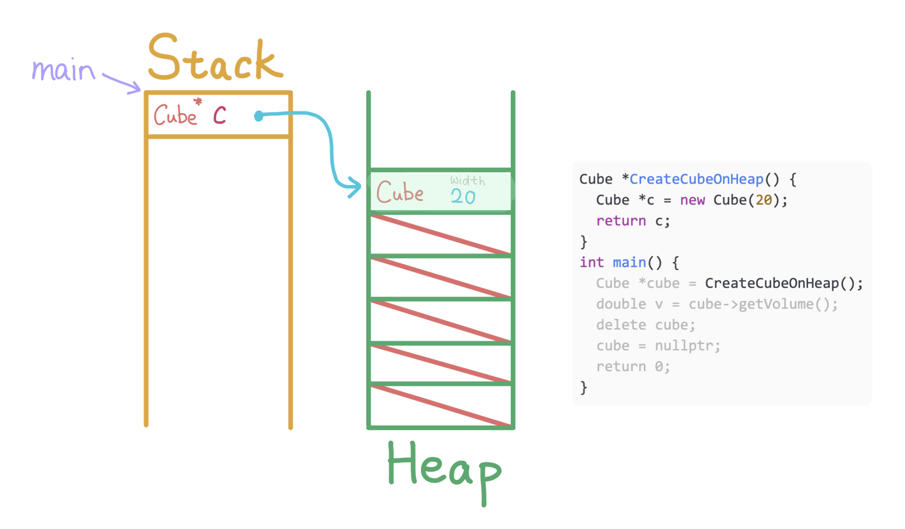
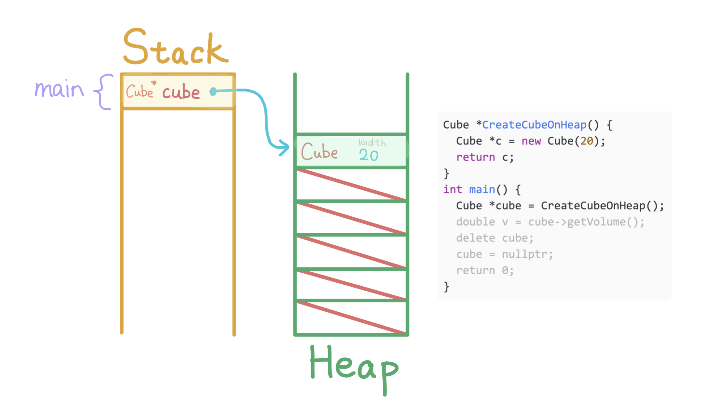
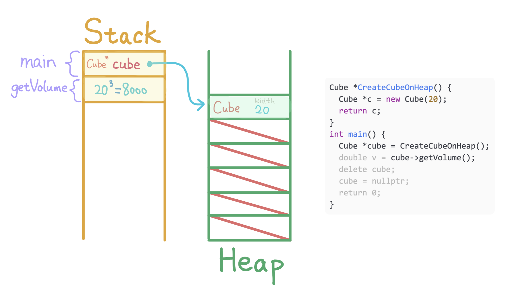
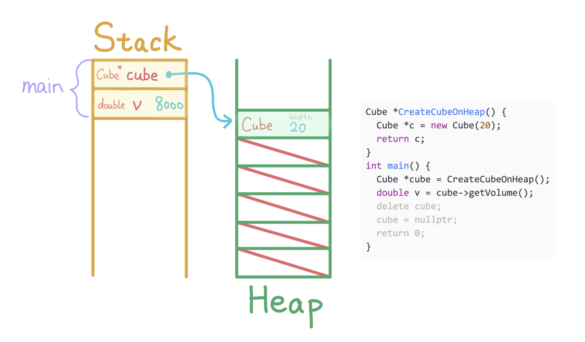
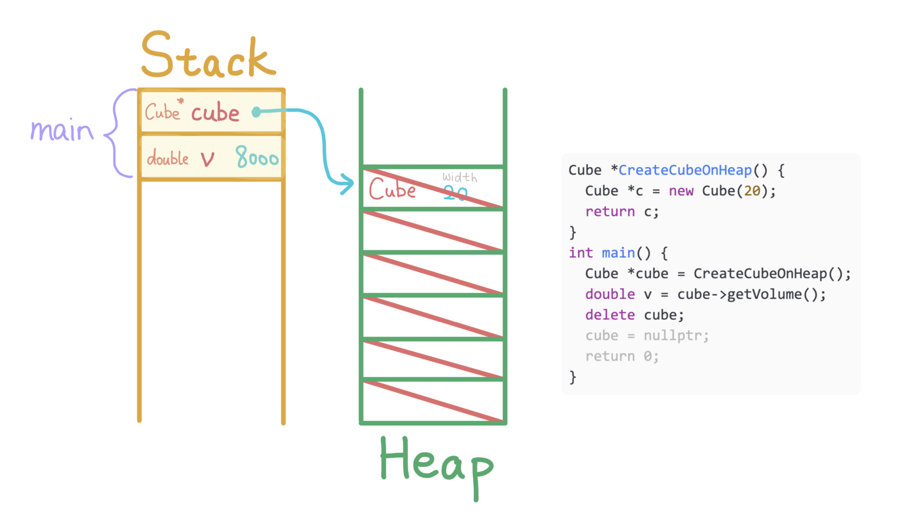
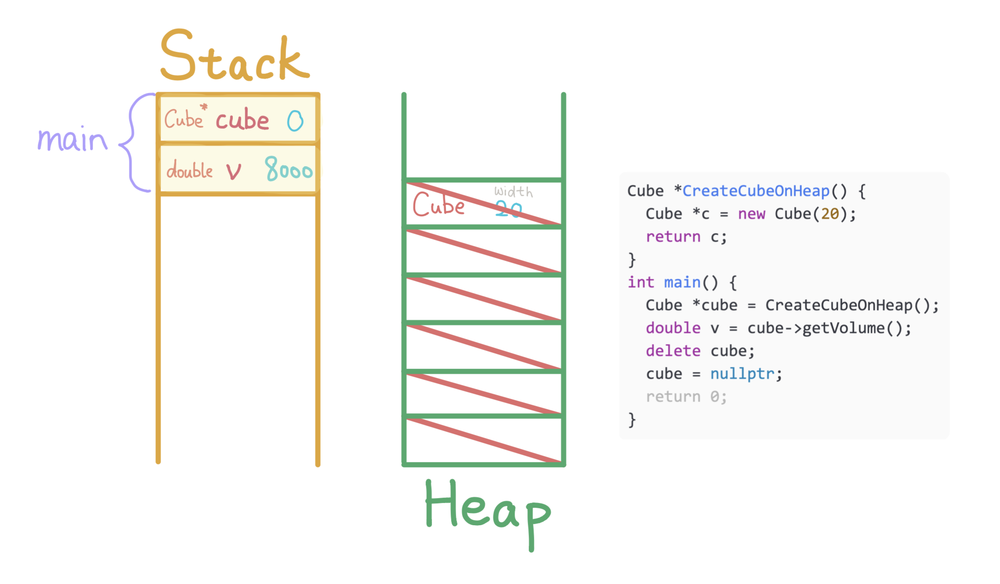
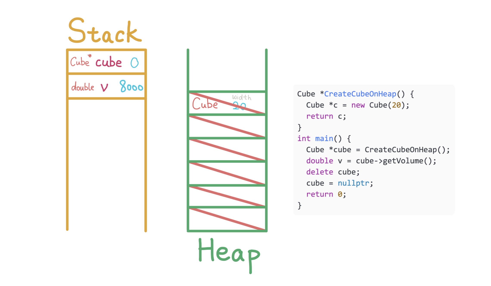

1. Allocate a `Cube` width `20` on the heap, allocate a Cube pointer `c` on `CreateCubeOnHeap`'s stack to store the address of the `Cube`.

---

2. Deallocate stack memory for `CreateCubeOnHeap` and return the value of pointer `c`.

---

3. Allocate `cube` on `main`'s stack and store the returned pointer.

---

4. Call method `getVolume` on `cube`, which calculates the volume to be `8000`.

---

5. Allocate double `v` to store the return value `8000`.

---

6. Deallocate the `Cube` pointed by `cube`, notice that cube is **still pointing to invalid memory** on heap

---

7. Set the value of `cube` to `nullptr`, which is `0`.

---

8. Deallocate the stack memory of `main`.
