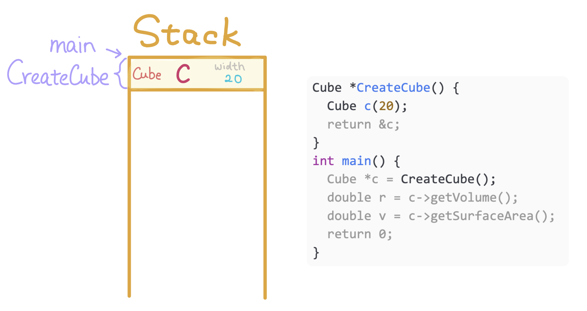
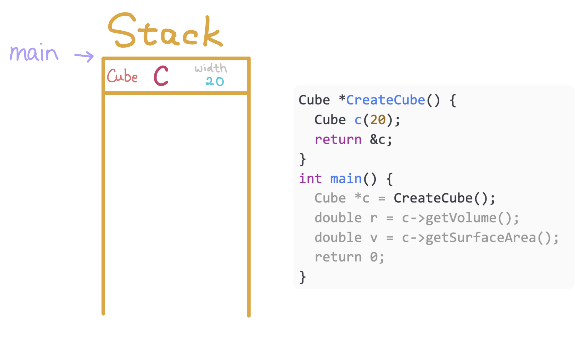
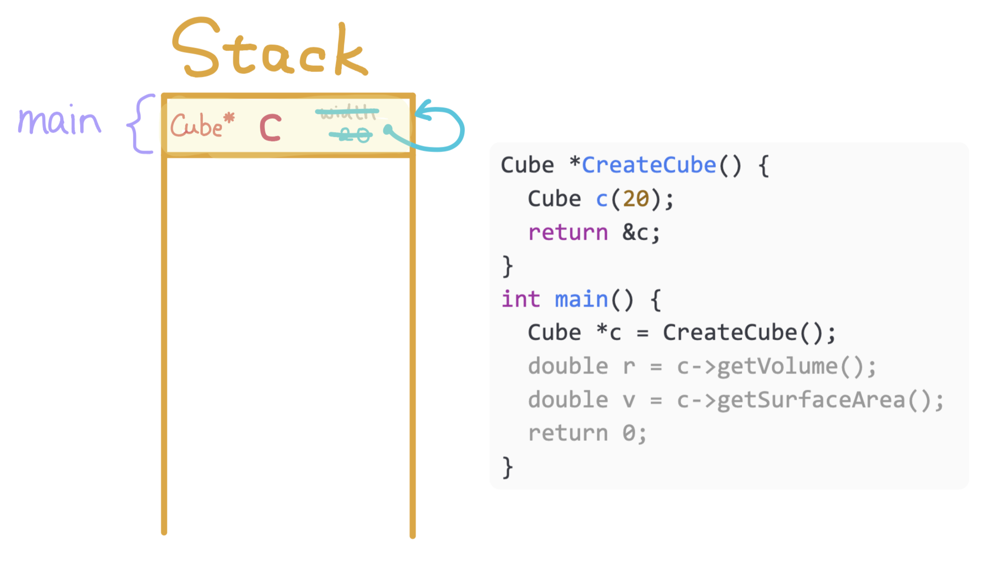
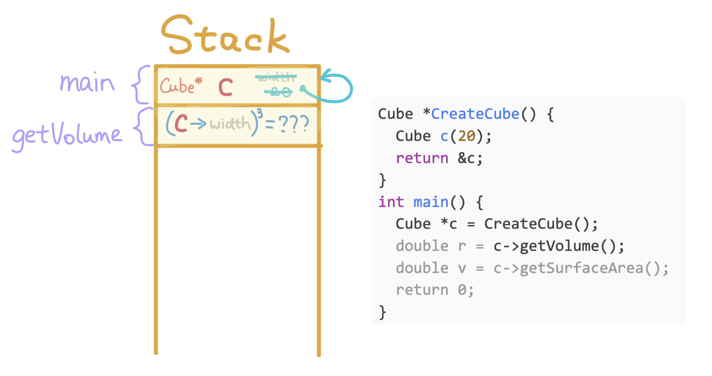
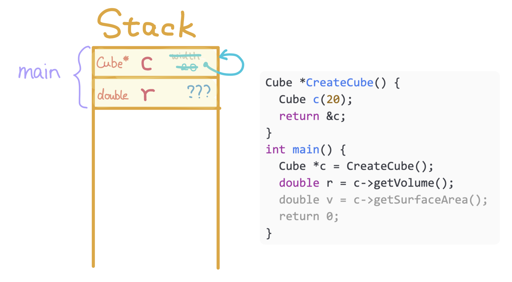
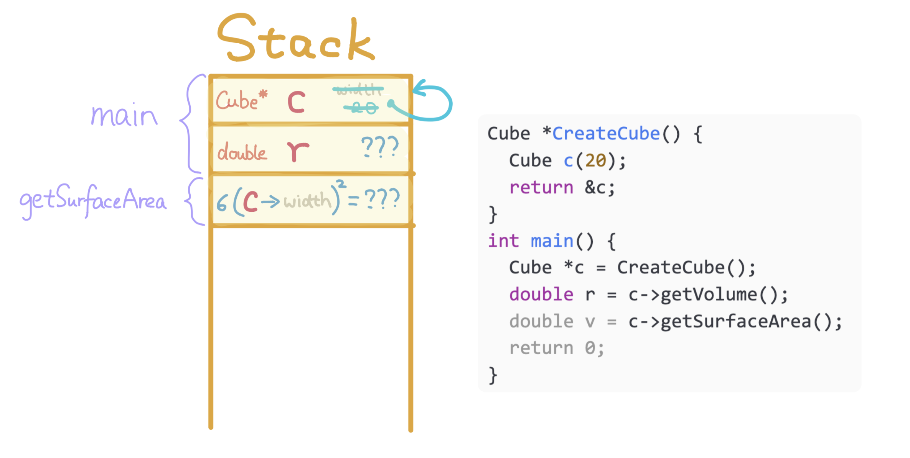
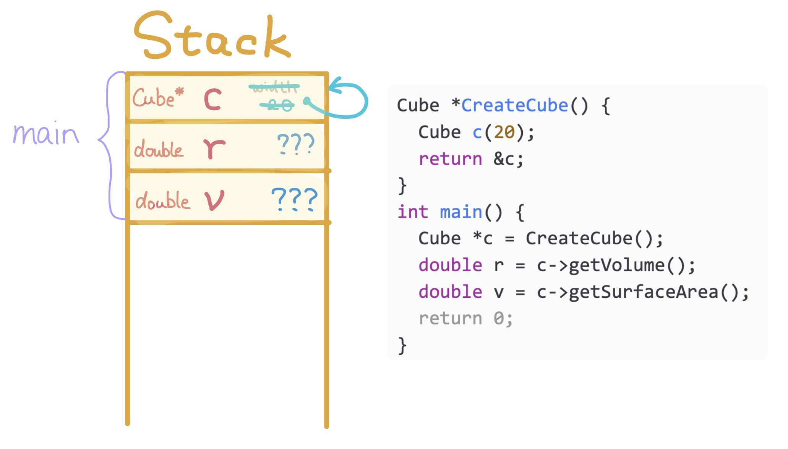
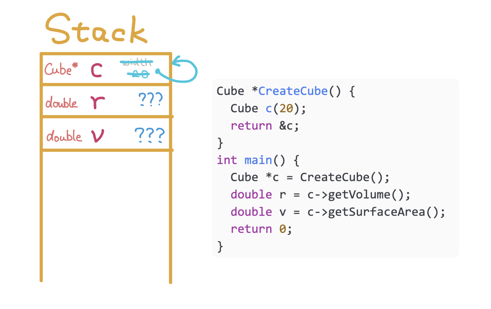

1. Allocate Cube `c` for `CreateCube`.

---

2. Deallocate stack memory of `CreateCube` and return address of `c`.

---

3. Allocate pointer `c` for `main` and store the returned value. Notice that the stack memory of `CreateCube` is **overwritten**.

---

4. Allocate stack memory for `getVolume` and calculate volume using the width of `c`. Since the width of `c` is **corrupted**, the volume is also **incorrect**.

---

5. Deallocate memory of `getVolume`. Allocate `r` for `main` to store the return value of `getVolume`.

---

6. Allocate stack memory for `getSurfaceArea` and calculate surface area using the width of `c`. Similar to `getVolume`, the surface area calculated will be incorrect.

---

7. Deallocate memory of `getSurfaceArea`. Allocate `v` for main to store the return value of `getSurfaceArea`.

---

8. Deallocate the stack memory of `main` and return `0`
