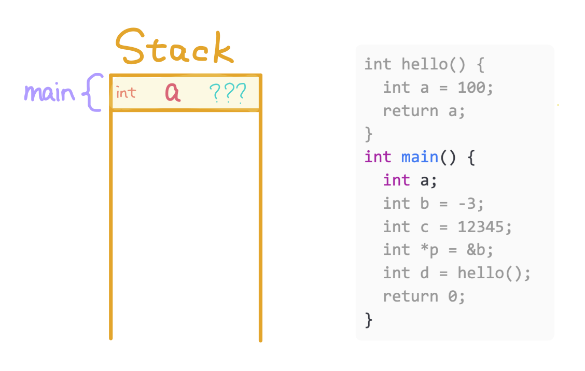

1. Allocate variable `a` for `main`.

---

2. Allocate `b` for main and store `-3`.

---

3. Allocate `c` for `main` and store `12345`.

---

4. Allocate `p` for `main` and store address of `b`.

---

5. Allocate variable `a` for `hello` and store `100`.

---

6. Deallocate the stack memory of `hello` and return `100` to `main`.

---

7. Allocate `d` for `main` and store `100`.

---

8. Deallocate the stack memory of `main` and return `0`.
